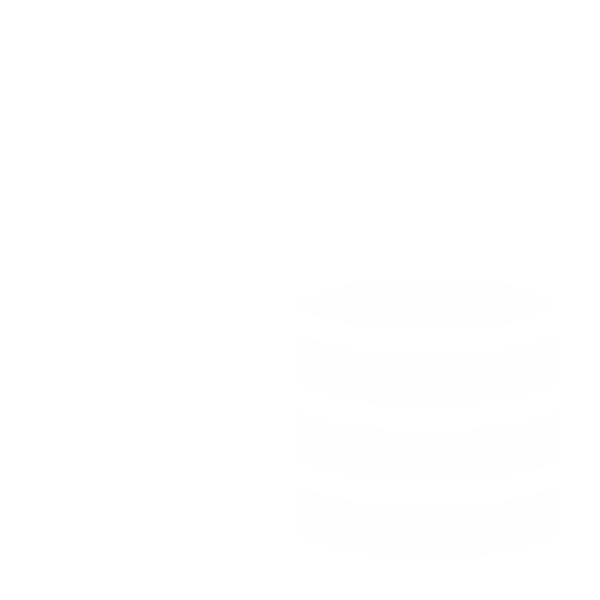
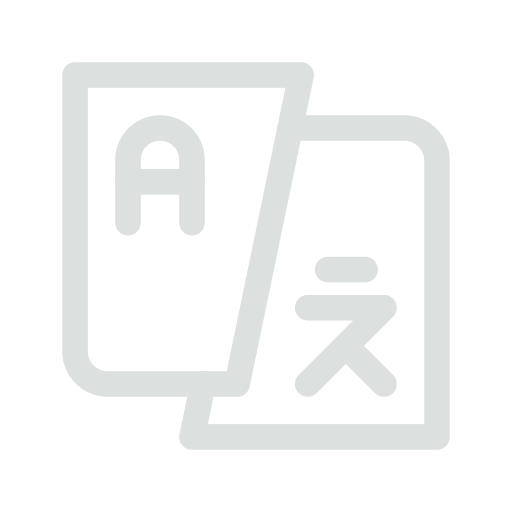

<a id="readme-a"><a>

<!-- Project Header -->

  

    

<h1 align="center"> Python Codes </h1>

The purpose of this repository is to showcase various Python projects. It covers a wide range of topics and includes solutions to different Python challenges.

<h1>Index</h1>
<h3>AI</h3>
</img>

 - Mining Text - Location: AI Folder

<h3>한국어</h3>
</img>

 - Korean Stop Words - Location: KR

